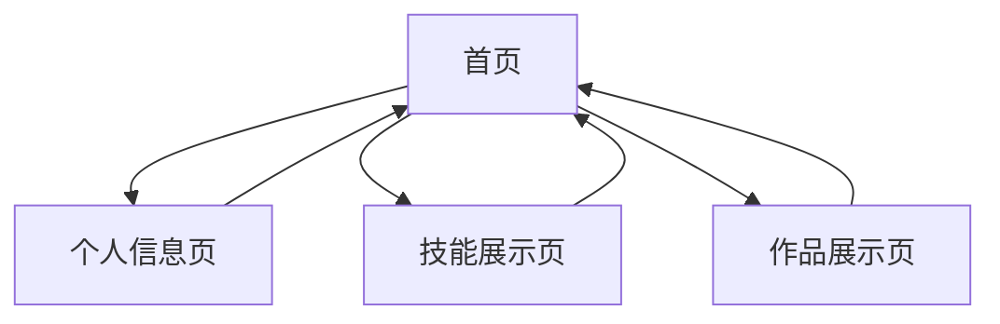

## 1. Product Overview
个人简介网站，展示用户的个人信息、技能和作品，以暖色系和枫叶元素为设计风格。
- 主要目的是展示用户的个人信息、技能和作品，作为个人品牌的在线展示平台。
- 目标用户是潜在雇主、合作伙伴和同学，展示用户的专业能力和个人特色。

## 2. Core Features

### 2.1 User Roles
| Role | Registration Method | Core Permissions |
|------|---------------------|------------------|
| Visitor | No registration required | Browse all content |

### 2.2 Feature Module
1. **首页**: 个人介绍、技能展示、作品预览、导航菜单
2. **个人信息页**: 详细个人信息、教育背景、兴趣爱好
3. **技能展示页**: 详细技能介绍、作品案例
4. **作品展示页**: 作品详情、项目描述

### 2.3 Page Details
| Page Name | Module Name | Feature description |
|-----------|-------------|---------------------|
| 首页 | 个人介绍 | 展示个人照片、姓名、专业、简短介绍，动态效果 |
| 首页 | 技能展示 | 展示核心技能，包括PS、剪辑、编程、前端开发、AI训练等 |
| 首页 | 作品预览 | 展示部分作品缩略图，点击可进入详情 |
| 首页 | 导航菜单 | 提供到各个分区的链接 |
| 个人信息页 | 详细信息 | 展示完整个人信息，包括教育背景、兴趣爱好等 |
| 个人信息页 | 兴趣展示 | 展示用户的爱好，如唱跳rap篮球等 |
| 技能展示页 | 技能详情 | 详细介绍各项技能的掌握程度和相关经验 |
| 技能展示页 | 作品案例 | 展示与各项技能相关的作品案例 |
| 作品展示页 | 作品详情 | 展示作品的详细信息，包括项目描述、使用技术等 |
| 作品展示页 | 作品展示 | 以图片、视频等形式展示作品 |

## 3. Core Process
用户访问网站首页，通过导航菜单进入各个分区页面，浏览个人信息、技能和作品。

## 4. User Interface Design
### 4.1 Design Style
- 主色调：暖色系（橙色、红色、黄色）
- 辅助色：枫叶红、金色
- 按钮风格：圆角按钮，有轻微的3D效果
- 字体：无衬线字体，标题使用更有设计感的字体
- 布局风格：卡片式布局，顶部导航
- 图标/表情风格：简约现代，带有枫叶元素

### 4.2 Page Design Overview
| Page Name | Module Name | UI Elements |
|-----------|-------------|-------------|
| 首页 | 个人介绍 | 大型英雄区，个人照片，动态文字效果，枫叶背景元素 |
| 首页 | 技能展示 | 技能卡片，悬停效果，进度条展示技能水平 |
| 首页 | 作品预览 | 作品卡片，图片轮播，悬停放大效果 |
| 首页 | 导航菜单 | 固定顶部导航，滚动时背景变化，枫叶图标 |
| 个人信息页 | 详细信息 | 时间线展示教育背景，卡片式布局个人信息 |
| 个人信息页 | 兴趣展示 | 图标展示兴趣爱好，动态效果 |
| 技能展示页 | 技能详情 | 技能分类展示，详细描述，相关作品链接 |
| 技能展示页 | 作品案例 | 案例卡片，图片展示，简短描述 |
| 作品展示页 | 作品详情 | 大型图片/视频展示，详细项目描述，技术栈标签 |
| 作品展示页 | 作品展示 | 图片画廊，视频嵌入，下载链接 |

### 4.3 Responsiveness
- 桌面优先设计，同时支持移动端适配
- 移动端采用单列布局，导航改为汉堡菜单
- 触控优化，确保在移动设备上的良好体验

### 4.4 3D Scene Guidance
- 可选择在首页添加简单的3D枫叶飘落效果
- 使用Three.js实现轻量级的3D动画
- 确保3D效果不影响页面加载速度和性能