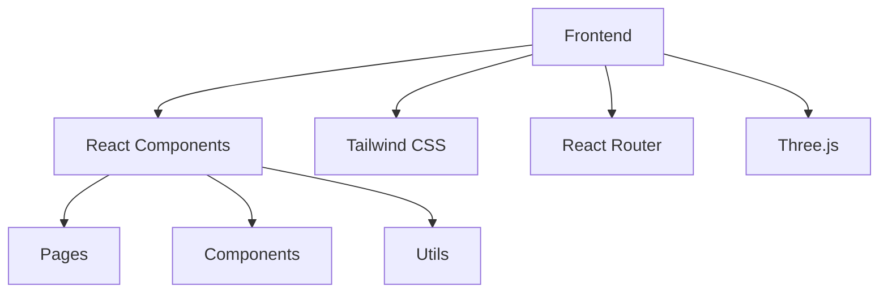

## 1. Architecture Design

## 2. Technology Description
- Frontend: React@18 + tailwindcss@3 + vite
- Initialization Tool: vite-init
- Backend: None (纯前端项目)
- Database: None (静态内容)

## 3. Route Definitions
| Route | Purpose |
|-------|---------|
| / | 首页，展示个人简介、技能和作品预览 |
| /about | 个人信息页，展示详细个人信息和兴趣爱好 |
| /skills | 技能展示页，展示详细技能和作品案例 |
| /projects | 作品展示页，展示作品详情和项目描述 |

## 4. API Definitions
无后端API，使用静态数据

## 5. Server Architecture Diagram
无后端架构

## 6. Data Model
无数据模型，使用静态数据

### 6.1 Data Model Definition
无

### 6.2 Data Definition Language
无